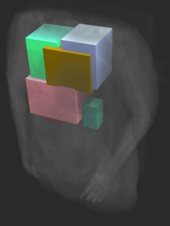

# MRI-AI: Faster R-CNN for Object Detection in 3D. Based on [matterport](https://github.com/matterport/Mask_RCNN) implementation

This project is a personal one. I wanted to do somethin cool, so I thought of applying my knowledge into medicine.
The ideea is to predict bounding boxes given a 3D volume from MRI or CT scanner.



In order to do this, I started writing code for a tool for visualization and annotation as you can see in the following figure. I'm not an expert in graphics so I just used some pre-made unity assets.


The second thing that I did was to modify every operation from the network so run in 3D. I also had to modify tensorflow backend because some of the operations were not supported in 3D. So you should download my fork of tensorflow, compile it and install.
As I manually labeled some examples (only 5 of them found in in input_MaskRCNN_128, the rest of 13 examples are unlabeled), I thought that in order to improve the training, I should train the feature extraction part using an autoencoder.
The output of the autoencoder after training looks like in the following gif.


You should be able to download it, and if you have all the requirements installed (most important, my tensorflow version) you should be able to run is instantly using:
```
# test the model
python test_MRI.py
# train the model
python train_MRI.py
```
You should be able to play with the volume tool, found in volume tool directory. It is compiled for Linux.
